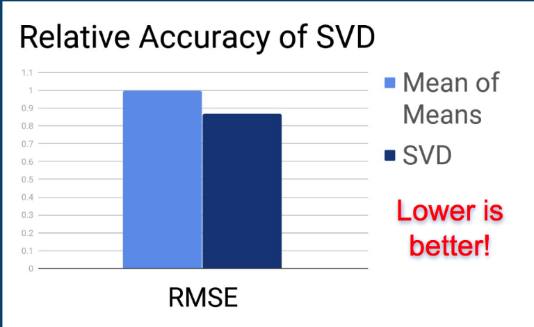
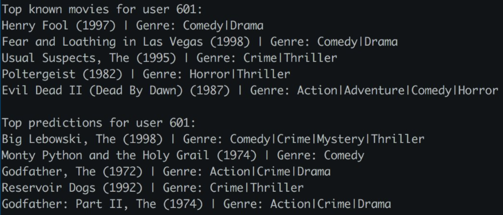
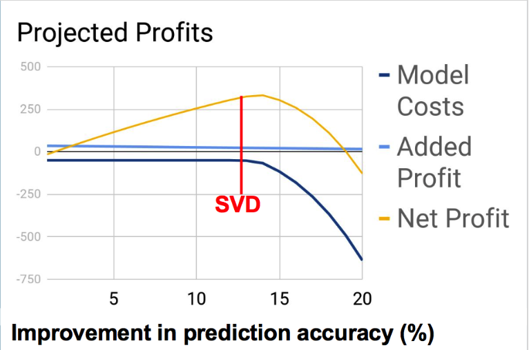

# Recommender Case study for galvanize
*See recommender pdf to see our work*  

## Introduction
For this case study we used a dataset of movies and their ratings from users to create a recommender system. Our final product increased accuracy 13% when compared to an existing mean of means system.

## Model
We created a singular-value decomposition (SVD) which can find underlying features of movies, such as the "action-ness", to better group movies and therefor give better recommendations. Using these features, we can give users recommendations of unwatched movies that more closely match their preferences.  
  
To measure accuracy, we examined the root mean squared error (RMSE). The RMSE of the mean of means system we measured to be .997, where our model was .874. *Lower RMSE is better*.  
  
  
  
### An example prediction
  
  
  
### Other reasons for SVD
- The model is straight out of the box (no tuning) and can be improved even more with more domain knowledge
- Every percent improvement can lead to happier customers, and more sales
- Can A/B test before deploying to all customers
  

  
